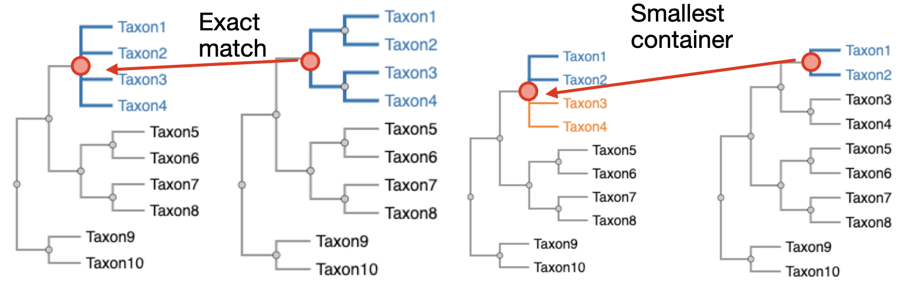

# TreeSort Cladeset Mapping

Tools for mapping reassortment annotations and their statistical summaries from phylogenetic trees that have been modified by TreeSort back to the original, interpretable trees.

## Overview

TreeSort is a tool that analyzes phylogenetic trees and multiple sequence alignments to identify reassortment events in segmented viruses like influenza. However, it can modify the tree by either binarizing polytomies or collapsing internal nodes. This can render trees difficult to view, particularly with Nextstrain and Auspice. There is thus a need for annotations to be mapped back to the original tree structure.

This repository utilizes the following observations about trees:

- There is a one-to-one correspondence between internal nodes and all their descendant leaves
- This correspondence can be used to map data on one topology to another using “cladesets” defined by leaves
- One can find the smallest cladeset in a "target" tree that contains the set in a "source" tree
- This can be used to associated the corresponding internal nodes in the source and target trees

See the illustration below, where an exact match occurs between cladesets in a target and source tree (left), or a smallest containing cladeset can be identified and used to associate internal nodes (right).



## Installation

While this tool will find most utility when incorporated with other repos, for reproducbility we provide enough context to run a standalone example.

Make sure you have installed [Bioconda](https://bioconda.github.io/) and configured it correctly as described in the link.

To install the environment:

```
conda create -n treesort-cladesets dendropy augur
```

Before running scripts, open a new shell and activate the environment:

```
conda activate treesort-cladesets
```

## Usage

**`mapper.py`** - Main processing script that:

- Parses TreeSort summary JSONs with information on TreeSort topoologies
- Maps events from modified trees back to original trees using cladeset matching
- Handles both direct matches (identical leaf sets) and subclade matches
- Outputs node JSON files compatible with Augur for Nextstrain visualization

```bash
python mapper.py data/summary_reassortment.json data/output.nwk input.nwk labeled.nwk node.json
```

**Arguments (in order):**

1. `treesort_json` - Input TreeSort reassortment summary JSON
2. `source_tree` - Input source tree, for TreeSort topological information
3. `target_tree` - Input target tree, where reassortment events will be mapped to
4. `labeled_tree` - Output tree with internal node labels
5. `auspice_json` - Output Auspice JSON node file

See also `run.sh` for how to visualize with Auspice.

## Details

The original tree is parsed, and every internal node is given a name to ensure consistency in the mapping step and the Auspice visualization. This tree should also be fed into Augur export to ensure that mapped reassortment events. Modifications in topology can be accommodated by cladeset matching.

### Cladeset Matching Algorithm

The algorithm maps reassortment events from TreeSort statistical summaries to tree structures that are more easily interpreted. The current implementation uses an efficient "Ancestral Walk" approach that replaces the previous brute-force method.

#### Core Components

**1. Taxon Normalization**
Before mapping, the algorithm standardizes leaf names between source and target trees. TODO: this will be deprecated, dates were inadvertently added twice and this does not seem like the appropriate thing for a modular pipeline.

**2. Hybrid Format Parser**
TreeSort statistical summaries use a custom JSON format. A parser extracts both tree topology and internal node labels that standard parsers cannot reliably read.

**3. Efficient Mapping Strategy**
Instead of the previous O(N*M) brute-force search, the new algorithm:

- Builds leaf-set indices for both trees upfront
- Uses set containment logic to identify valid mappings
- Employs ancestral walk patterns to find optimal node assignments
- Picks a random leaf from the source cladeset in the target cladeset, and walks back one ancestor at a time until a containing set is found
- Maps each reassortment event to the smallest containing clade

This approach maintains the same mapping accuracy as the original algorithm while providing significant performance improvements for large phylogenetic trees.